# Bank Marketing Campaign - Term Deposit Subscription Prediction Using Machine Learning


---

# Table of Contents

- Project Results
- Project Overview
- Project Objectives
- Dataset Information
- Technologies Used
- Project Structure
- Data Cleaning and Preprocessing
- Exploratory Data Analysis (EDA)
- Model Development
- Model Evaluation
- Explainable AI (SHAP)
- Key Findings
- Conclusion
- How to Run the Project
- Author

---

# Project Results

| Metric | Value |
|---------|--------|
| Dataset Records | 45,211 |
| Original Features | 17 |
| Final Features | 42 |
| Missing Values Handling | Completed |
| Duplicate Records Check | Completed |
| Feature Encoding | Completed |
| Exploratory Data Analysis | Completed |
| Logistic Regression | Completed |
| Random Forest | Completed |
| ROC Curve | Completed |
| SHAP Explainability | Completed |
| Best Model | Random Forest |
| Logistic Regression Accuracy | 90.12% |
| Random Forest Accuracy | 90.59% |

---

# Project Overview

This project focuses on predicting whether a bank customer will subscribe to a **term deposit** after being contacted during a direct marketing campaign.

The project uses the **Bank Marketing Dataset** from the UCI Machine Learning Repository and demonstrates a complete end-to-end machine learning workflow. The analysis includes data preprocessing, exploratory data analysis (EDA), feature engineering, model development, performance evaluation, and Explainable Artificial Intelligence (XAI) using SHAP.

Two supervised machine learning classification models were developed and compared:

- Logistic Regression
- Random Forest Classifier

Finally, SHAP (SHapley Additive exPlanations) was applied to explain both the overall feature importance and individual customer predictions, improving the transparency and interpretability of the final model.

This project was completed as part of the **DevelopersHub Corporation Data Science & Analytics Internship Program**.

---

# Project Objectives

The objectives of this project are:

- Understand the Bank Marketing dataset.
- Perform data cleaning and preprocessing.
- Handle categorical variables using appropriate encoding techniques.
- Conduct Exploratory Data Analysis (EDA).
- Analyze customer characteristics and marketing campaign data.
- Train multiple machine learning classification models.
- Compare model performance using evaluation metrics.
- Evaluate models using Confusion Matrix, Classification Report, F1-Score, and ROC Curve.
- Explain model predictions using SHAP Explainable AI.
- Generate business insights that can improve future marketing campaigns.

---

# Dataset Information

**Dataset:** Bank Marketing Dataset

**Source:** UCI Machine Learning Repository

**Problem Type:** Binary Classification

**Target Variable:** `y`

### Target Variable

| Value | Meaning |
|---------|---------|
| 0 | Customer did not subscribe |
| 1 | Customer subscribed |

---

## Dataset Summary

| Attribute | Value |
|------------|-------|
| Dataset Name | Bank Marketing Dataset |
| Source | UCI Machine Learning Repository |
| Total Records | 45,211 |
| Original Features | 17 |
| Features After Encoding | 42 |
| Target Variable | y |
| Problem Type | Binary Classification |
| Domain | Banking and Marketing |

---

## Dataset Features

| Feature | Description |
|----------|-------------|
| age | Customer Age |
| job | Customer Occupation |
| marital | Marital Status |
| education | Education Level |
| default | Credit in Default |
| balance | Average Yearly Balance |
| housing | Housing Loan Status |
| loan | Personal Loan Status |
| contact | Communication Type |
| day | Last Contact Day |
| month | Last Contact Month |
| duration | Last Contact Duration |
| campaign | Number of Contacts During Campaign |
| pdays | Days Since Previous Contact |
| previous | Previous Contacts |
| poutcome | Previous Campaign Outcome |
| y | Term Deposit Subscription |

---

# Technologies Used

- Python
- Pandas
- NumPy
- Matplotlib
- Scikit-Learn
- SHAP (Explainable AI)
- Jupyter Notebook

---

# Project Structure

```text
Project-01-Term-Deposit-Prediction/
│
├── dataset/
│   └── bank-full.csv
│
├── notebooks/
│   └── term_deposit_prediction.ipynb
│
├── outputs/
│   └── figures/
│
├── requirements.txt
└── README.md
```

---

# Data Cleaning and Preprocessing

The dataset was carefully preprocessed before training the machine learning models.

### Tasks Performed

- Missing values analysis
- Duplicate records verification
- Data type inspection
- Binary Encoding
- One-Hot Encoding
- Feature transformation
- Feature and target selection
- Correlation analysis
- Train-Test Split
- Feature Scaling (Logistic Regression)

---

# Exploratory Data Analysis (EDA)

Exploratory Data Analysis (EDA) was performed to understand the characteristics of the dataset before developing machine learning models.

The analysis focused on understanding customer demographics, banking information, marketing campaign characteristics, feature relationships, and the distribution of the target variable.

Several statistical summaries and visualizations were generated to identify important patterns and insights within the dataset.

---

## Visualizations Performed

The following visualizations were created during the exploratory data analysis phase:

- Term Deposit Subscription Distribution
- Age Distribution
- Age Box Plot
- Job Distribution
- Marital Status Distribution
- Education Distribution
- Subscription Rate by Job
- Subscription Rate by Education
- Subscription Rate by Marital Status
- Balance Distribution
- Balance Box Plot
- Correlation Matrix
- Correlation Heatmap
- Model Comparison
- ROC Curve Comparison
- SHAP Feature Importance
- SHAP Waterfall Plot (Prediction 1)
- SHAP Waterfall Plot (Prediction 2)
- SHAP Waterfall Plot (Prediction 3)
- SHAP Waterfall Plot (Prediction 4)
- SHAP Waterfall Plot (Prediction 5)

---

# Sample Visualizations

## Term Deposit Subscription Distribution

<p align="center">
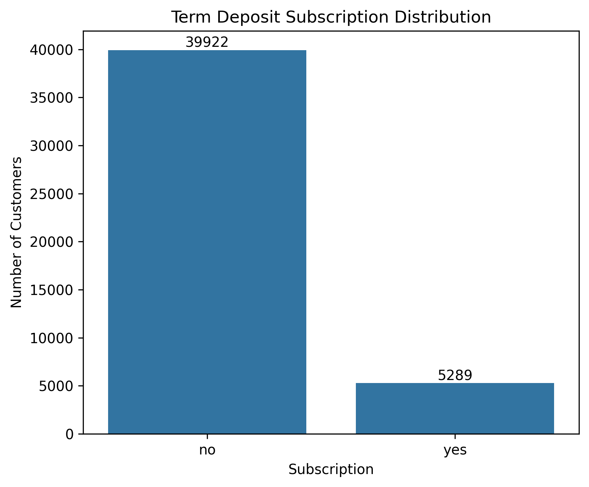
</p>

This visualization shows the distribution of customers who subscribed and did not subscribe to a term deposit. It indicates that the dataset is imbalanced, with the majority of customers not subscribing to the offered term deposit.

---

## Age Distribution

<p align="center">
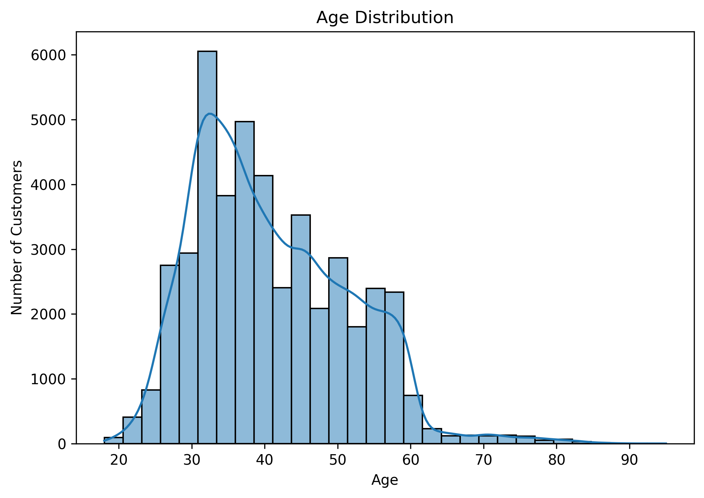
</p>

The age distribution illustrates that most customers belong to the middle-aged group, while relatively fewer customers are observed in the younger and older age categories.

---

## Age Box Plot

<p align="center">
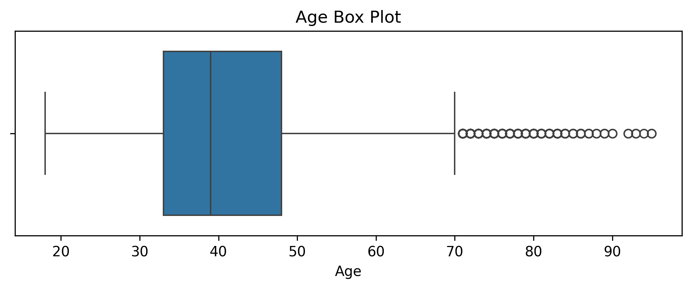
</p>

The box plot summarizes the distribution of customer ages and highlights the presence of several age outliers, particularly among older customers.

---

## Job Distribution

<p align="center">
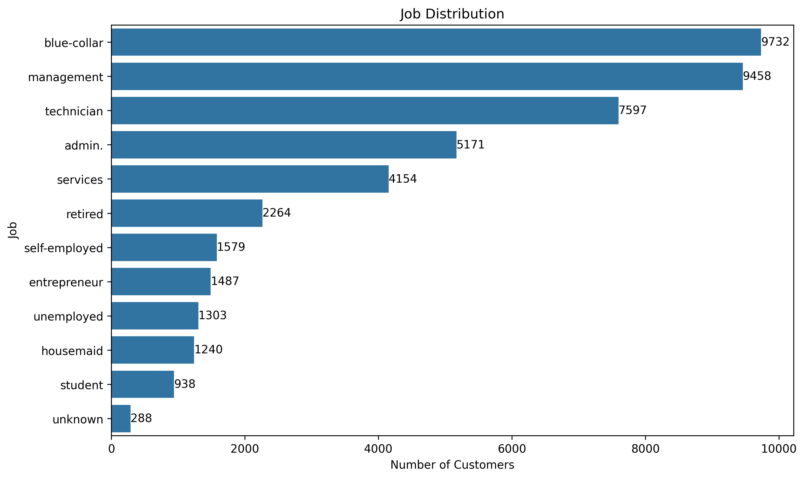
</p>

This chart presents the distribution of customers across different occupations. Management, blue-collar, and technician jobs represent the largest customer groups in the dataset.

---

## Subscription Rate by Job

<p align="center">
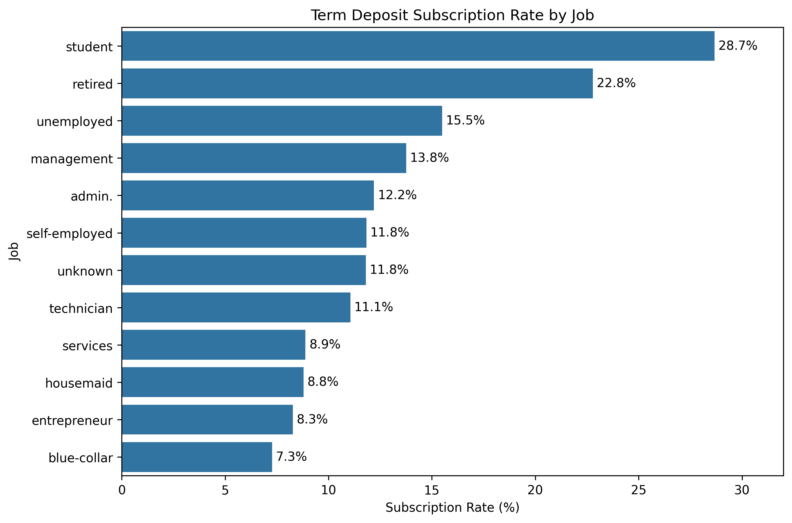
</p>

The subscription rate differs across job categories, indicating that customer occupation has a noticeable influence on the likelihood of subscribing to a term deposit.

---

## Education Distribution

<p align="center">
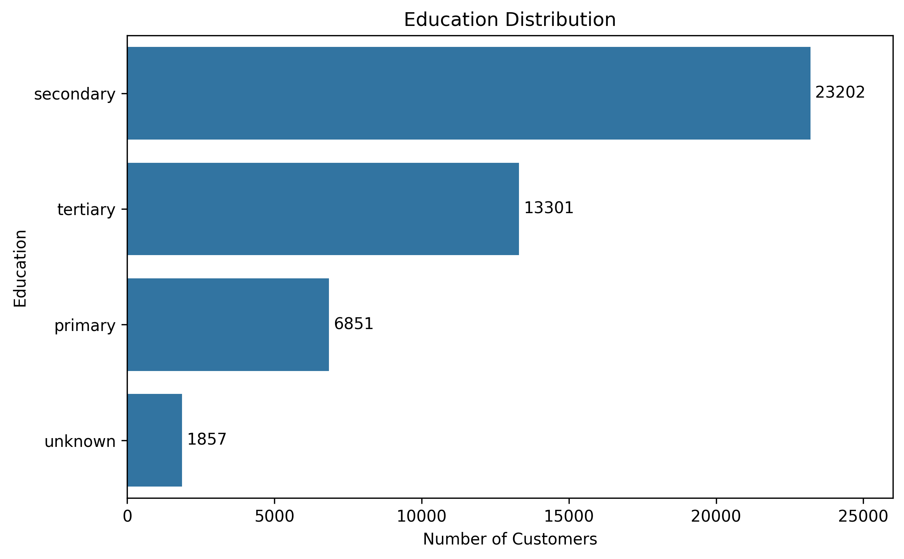
</p>

The education distribution shows that customers with secondary education form the largest group, followed by tertiary and primary education levels.

---

## Subscription Rate by Education

<p align="center">
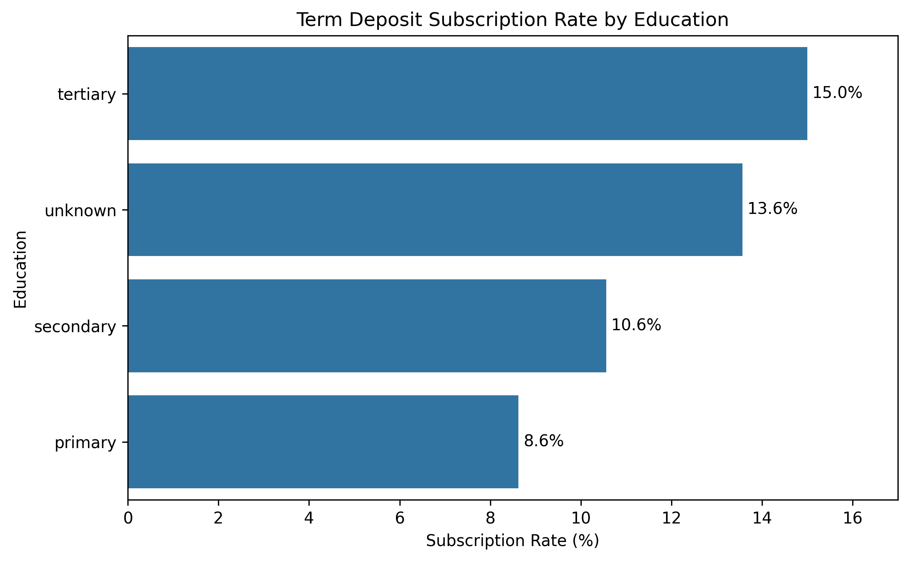
</p>

Customers with different education levels demonstrate varying subscription rates, suggesting that education contributes to customer decision-making.

---

## Balance Box Plot

<p align="center">
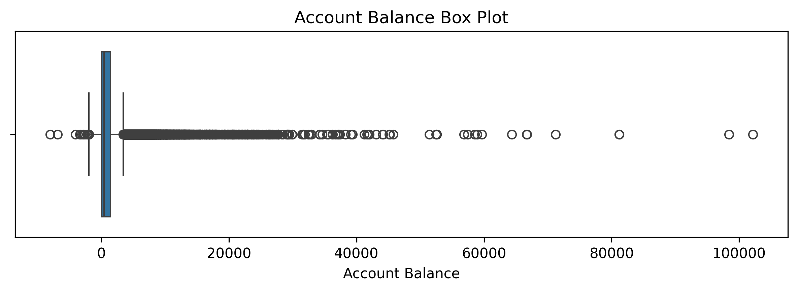
</p>

The balance box plot reveals a wide variation in customer account balances and identifies several high-value outliers.

---

## Previous Campaign Outcome Distribution

<p align="center">
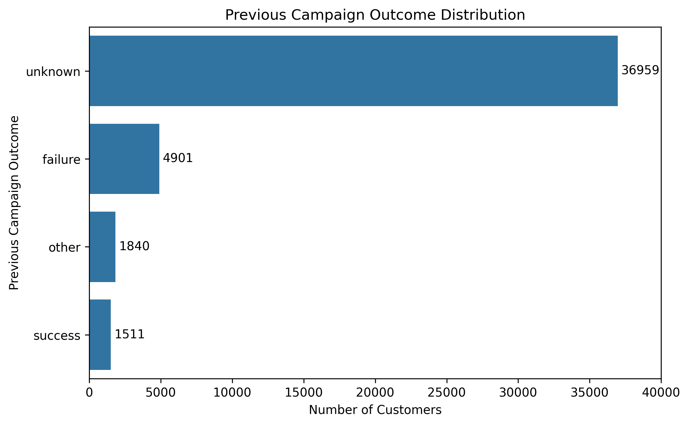
</p>

This visualization summarizes the outcomes of previous marketing campaigns. The majority of customers belong to the "unknown" category, while fewer customers experienced successful or failed previous campaigns.

---

## Subscription Rate by Previous Campaign Outcome

<p align="center">
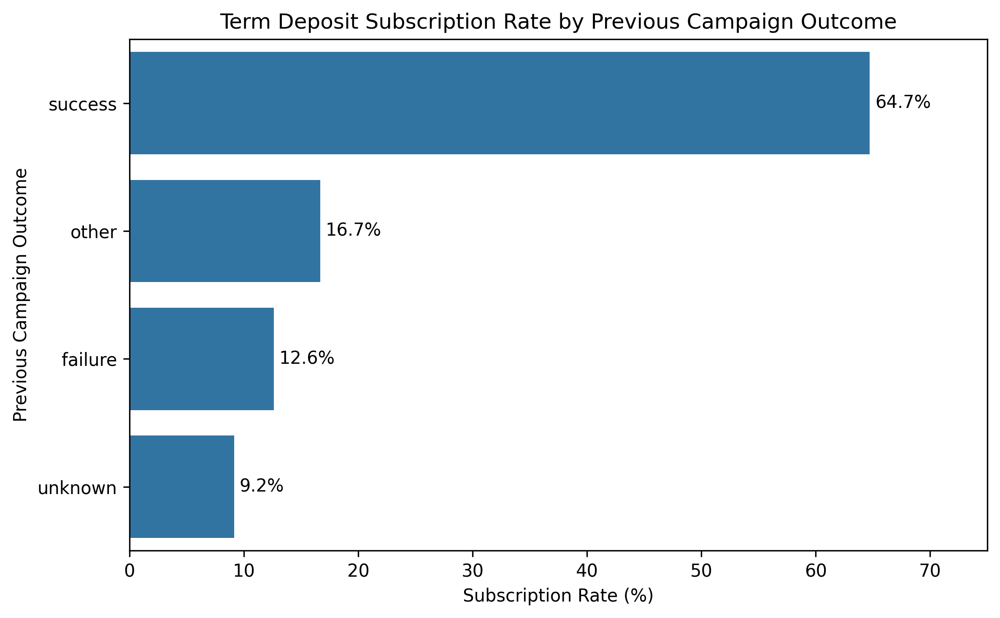
</p>

Customers who previously experienced a successful marketing campaign were considerably more likely to subscribe to a term deposit than customers from other outcome categories.

---

## Exploratory Data Analysis Summary

The exploratory data analysis revealed several important insights regarding customer demographics, financial characteristics, and marketing campaign performance.

Key observations include:

- The dataset is imbalanced, with significantly more customers not subscribing than subscribing.
- Customer age is concentrated around middle-aged groups.
- Occupation and education influence subscription behavior.
- Marital status also shows differences in customer responses.
- Customer balance varies substantially across the dataset.
- Feature correlations are generally weak, suggesting that customer subscription depends on multiple interacting variables.
- The dataset was successfully prepared for machine learning model development through appropriate preprocessing and feature engineering.

---

# Model Development

After completing data preprocessing and exploratory data analysis, machine learning models were developed to predict whether a customer would subscribe to a term deposit.

Two supervised classification algorithms were implemented and compared based on their predictive performance.

## Machine Learning Models

- Logistic Regression
- Random Forest Classifier

---

## Dataset Split

The dataset was divided into training and testing sets using an **80-20 split**.

| Dataset | Percentage |
|----------|------------|
| Training Data | 80% |
| Testing Data | 20% |

The training dataset was used to build the models, while the testing dataset was reserved for evaluating their performance on unseen data.

---

# Model Evaluation

Both models were evaluated using multiple classification metrics to ensure a comprehensive comparison.

## Evaluation Metrics

- Accuracy Score
- Precision
- Recall
- F1-Score
- Confusion Matrix
- Classification Report
- ROC Curve
- AUC Score

---

## Model Performance

| Metric | Logistic Regression | Random Forest |
|---------|--------------------:|--------------:|
| Accuracy | **90.12%** | **90.59%** |
| Precision | **64.40%** | **66.61%** |
| Recall | **34.88%** | **39.22%** |
| F1-Score | **45.25%** | **49.38%** |

The Random Forest classifier achieved the best overall performance across all evaluation metrics and was selected as the final model.

---

# Sample Model Visualizations

## Logistic Regression Confusion Matrix

<p align="center">
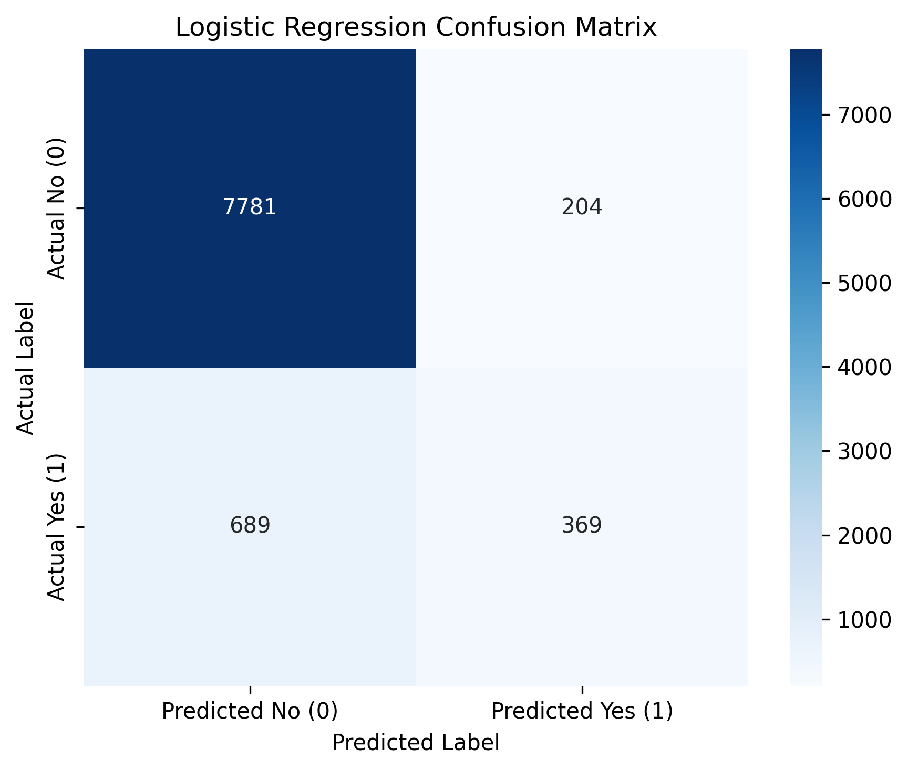
</p>

The confusion matrix shows that Logistic Regression correctly classified the majority of customers but struggled to identify all customers who subscribed to the term deposit.

---

## Random Forest Confusion Matrix

<p align="center">

</p>

Random Forest produced fewer classification errors and demonstrated better performance than Logistic Regression, particularly in identifying customers who subscribed.

---

## ROC Curve Comparison

<p align="center">
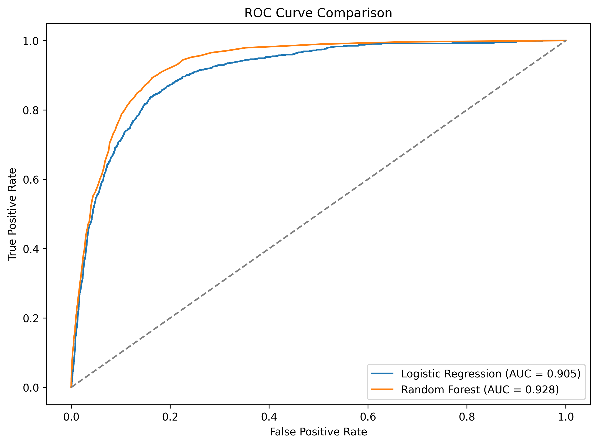
</p>

The ROC Curve compares the classification performance of both models across different probability thresholds.

The Random Forest classifier achieved a higher Area Under the Curve (AUC), indicating stronger discrimination between customers who subscribed and those who did not.

---

# Explainable AI (SHAP)

To improve model transparency and interpretability, **SHAP (SHapley Additive exPlanations)** was applied to the Random Forest model.

SHAP explains how each feature contributes to the model's predictions, allowing us to understand both global feature importance and individual customer predictions.

The explainability analysis included:

- SHAP Feature Importance
- SHAP Waterfall Plot – Prediction 1
- SHAP Waterfall Plot – Prediction 2
- SHAP Waterfall Plot – Prediction 3
- SHAP Waterfall Plot – Prediction 4
- SHAP Waterfall Plot – Prediction 5

---

## SHAP Feature Importance

<p align="center">
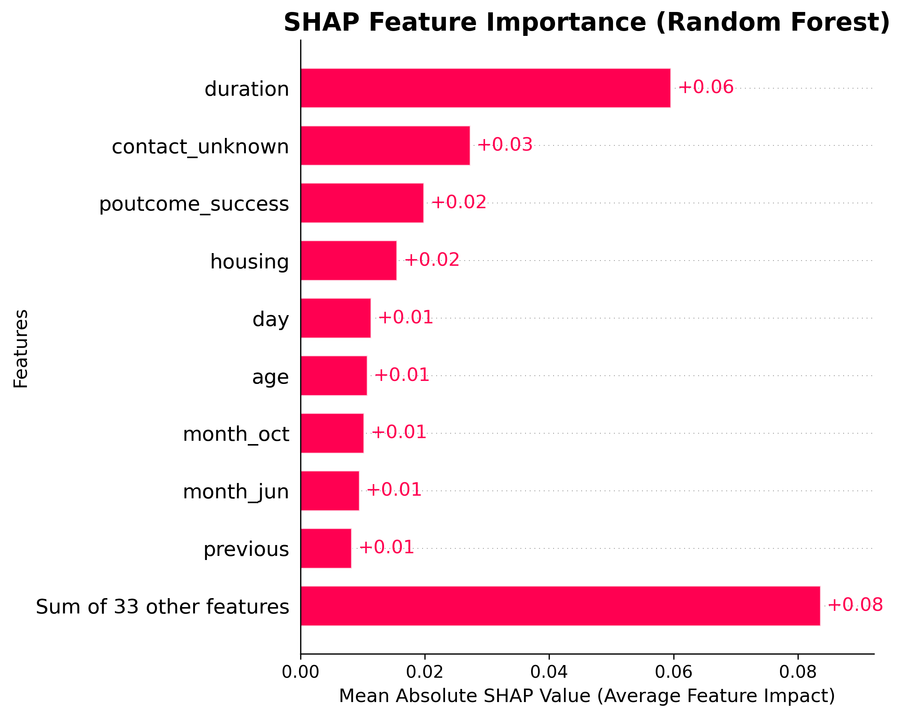
</p>

The SHAP Feature Importance plot illustrates the overall contribution of each feature to the Random Forest model. Features with higher mean absolute SHAP values have a greater influence on the model's predictions.

The analysis identified **duration** as the most influential feature, followed by **contact_unknown**, **poutcome_success**, **housing**, **day**, **age**, **month_oct**, **month_jun**, and **previous**. These variables play the most significant role in determining whether a customer subscribes to a term deposit.

---

## SHAP Waterfall Plot – Prediction 1

<p align="center">
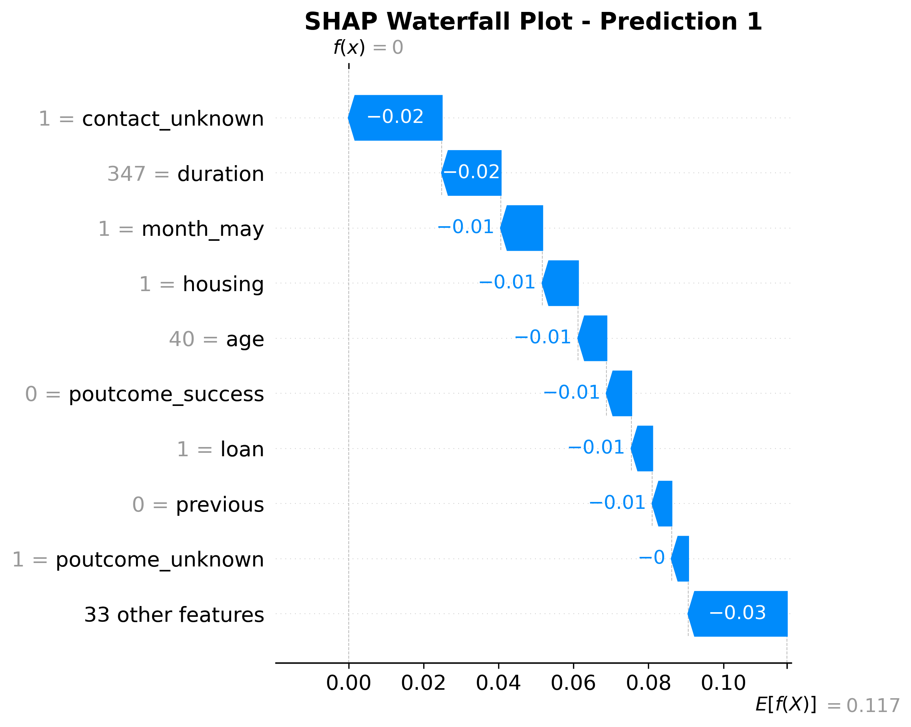
</p>

This waterfall plot explains how individual feature contributions influenced the first customer's prediction. Features shown in blue decreased the prediction score, while red features increased it.

---

## SHAP Waterfall Plot – Prediction 2

<p align="center">
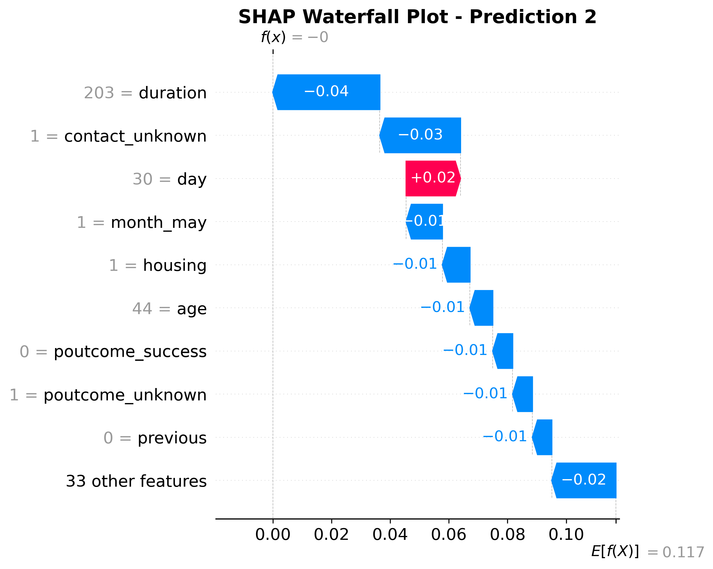
</p>

This visualization explains the second customer prediction by showing how each feature moved the prediction from the baseline value to the final prediction.

---

## SHAP Waterfall Plot – Prediction 3

<p align="center">
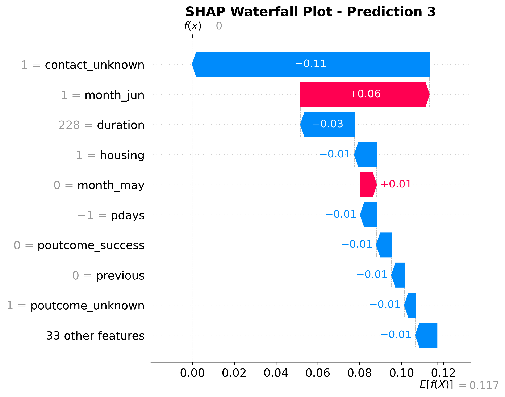
</p>

The third prediction demonstrates that multiple features jointly influenced the model decision, with both positive and negative SHAP contributions affecting the final output.

---

## SHAP Waterfall Plot – Prediction 4

<p align="center">
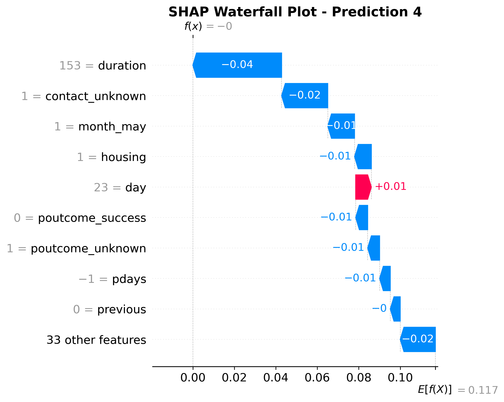
</p>

This waterfall plot illustrates another customer prediction where several features reduced the prediction score while a few features increased it, resulting in the model's final decision.

---

## SHAP Waterfall Plot – Prediction 5 (8th Test Sample)

<p align="center">
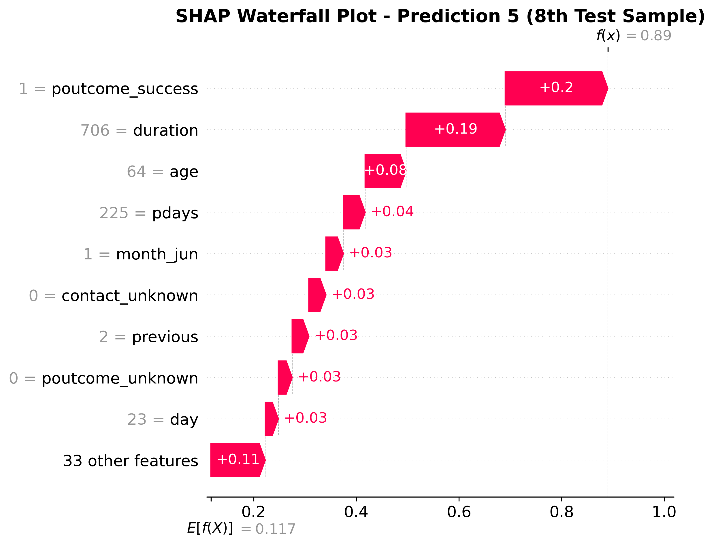
</p>

Unlike the previous examples, this customer was predicted with a high probability of subscribing to the term deposit. Positive contributions from **poutcome_success**, **duration**, **age**, **pdays**, **month_jun**, and other features collectively increased the prediction score to a high final value.

---

## Explainable AI Summary

The SHAP analysis significantly improved the interpretability of the Random Forest model.

Key observations include:

- Duration was the most influential feature.
- Previous marketing campaign outcomes strongly affected predictions.
- Customer contact type contributed significantly to subscription decisions.
- Multiple features jointly influenced each prediction rather than relying on a single variable.
- SHAP successfully explained both global feature importance and individual customer predictions, increasing model transparency.

---

# Key Findings

The analysis of the Bank Marketing dataset provided several important insights regarding customer behavior and marketing campaign effectiveness.

The major findings from this project are summarized below:

- Most customers did not subscribe to a term deposit, indicating an imbalanced target variable.
- Customer subscription behavior was influenced by multiple demographic, financial, and campaign-related factors.
- The **duration** of the last marketing call was identified as the most influential feature affecting customer subscription.
- Previous campaign outcomes (**poutcome**) significantly impacted customer decisions.
- Contact type and the month of contact also played important roles in predicting customer subscriptions.
- Logistic Regression provided strong baseline performance with an accuracy of **90.12%**.
- Random Forest achieved the highest predictive performance with an accuracy of **90.59%** and outperformed Logistic Regression across Precision, Recall, and F1-Score.
- SHAP Explainable AI successfully explained both global feature importance and individual customer predictions, improving model transparency and interpretability.

---

# Conclusion

The primary objective of this project was to develop a machine learning model capable of predicting whether a customer would subscribe to a term deposit following a bank marketing campaign.

A complete machine learning pipeline was implemented, including data preprocessing, exploratory data analysis, feature engineering, model training, evaluation, and explainability.

Two classification models, **Logistic Regression** and **Random Forest**, were trained and evaluated using multiple performance metrics such as Accuracy, Precision, Recall, F1-Score, Confusion Matrix, Classification Report, and ROC Curve.

Among the evaluated models, **Random Forest** demonstrated the best overall performance, achieving higher predictive accuracy and stronger classification capability than Logistic Regression.

To improve model interpretability, SHAP (SHapley Additive exPlanations) was applied to explain both feature importance and individual customer predictions. This provided valuable insights into how different customer characteristics influenced the model's decisions.

Overall, this project demonstrates a complete end-to-end machine learning workflow and highlights the practical application of Explainable Artificial Intelligence (XAI) for improving the transparency of predictive models used in banking and marketing decision-making.

---

# Future Improvements

Possible improvements for future versions of this project include:

- Hyperparameter tuning using GridSearchCV or RandomizedSearchCV.
- Applying additional machine learning algorithms such as XGBoost, LightGBM, or CatBoost.
- Handling class imbalance using techniques such as SMOTE.
- Performing feature selection to reduce model complexity.
- Deploying the trained model using Flask, FastAPI, or Streamlit.
- Developing an interactive dashboard for business users.

---

# How to Run the Project

## 1. Clone the Repository

```bash
git clone https://github.com/huzaifawaheed2/DevelopersHub-Corporation-Advanced-Internship.git
```

---

## 2. Navigate to the Project Folder

```bash
cd DevelopersHub-Corporation-Advanced-Internship/Project-01-Term-Deposit-Prediction
```

---

## 3. Install Required Libraries

```bash
pip install -r requirements.txt
```

---

## 4. Open Jupyter Notebook

```bash
jupyter notebook
```

---

## 5. Run the Notebook

```text
notebooks/term_deposit_prediction.ipynb
```

---

# Repository Contents

```text
Project-01-Term-Deposit-Prediction/
│
├── dataset/
│   └── bank-full.csv
│
├── notebooks/
│   └── term_deposit_prediction.ipynb
│
├── outputs/
│   └── figures/
│
├── requirements.txt
├── .gitignore
└── README.md
```

---

# Skills Demonstrated

- Data Cleaning
- Data Preprocessing
- Exploratory Data Analysis (EDA)
- Feature Engineering
- Feature Encoding
- Data Visualization
- Machine Learning
- Classification
- Model Evaluation
- Random Forest
- Logistic Regression
- ROC Curve Analysis
- Explainable AI (SHAP)
- Business Insight Generation

---

# Author

## Muhammad Huzaifa Waheed

Data Analyst | Power BI Developer | QA Engineer

### Connect With Me

* GitHub: [huzaifawaheed2](https://github.com/huzaifawaheed2)
* LinkedIn: [Muhammad Huzaifa Waheed](https://www.linkedin.com/in/muhammad-huzaifa-waheed-70043338b)

---

## Acknowledgements

This project was completed as part of the **DevelopersHub Corporation Data Science & Analytics Internship Program**.

The Bank Marketing dataset used in this project was obtained from the **UCI Machine Learning Repository** and is intended for educational and research purposes.

---

⭐ **If you found this project helpful, consider giving this repository a star!**