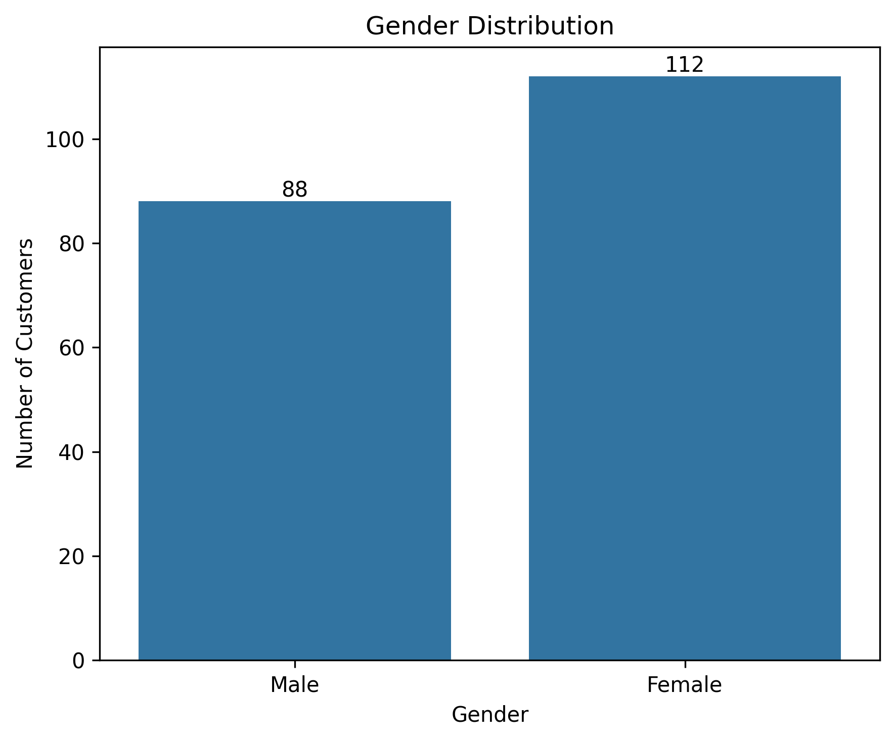
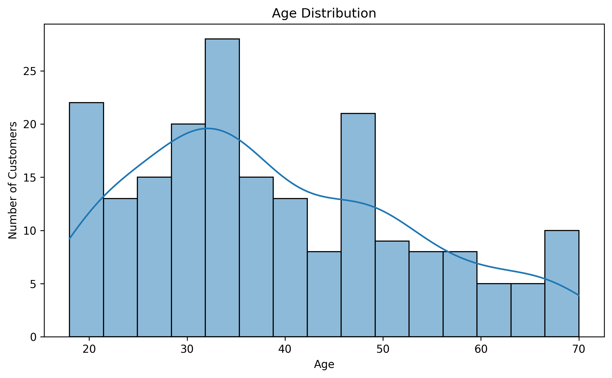
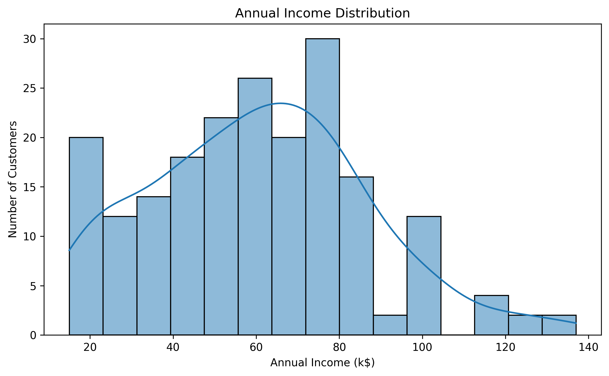
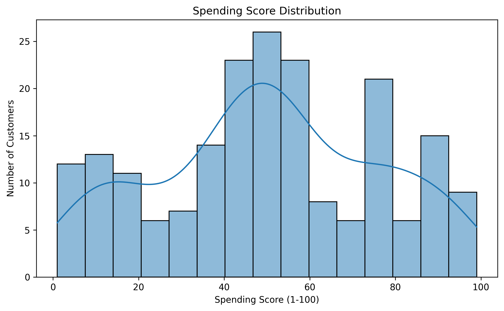
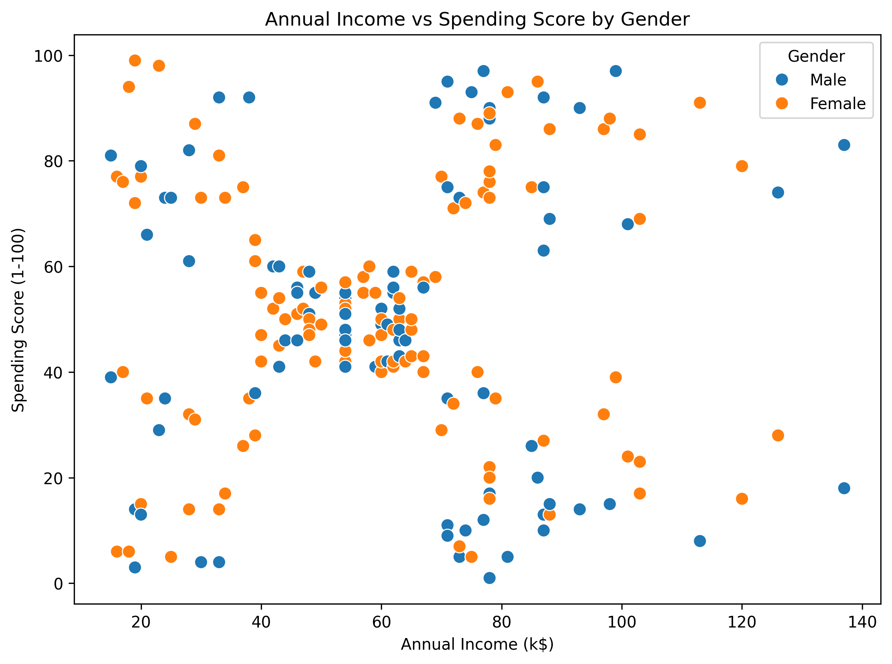
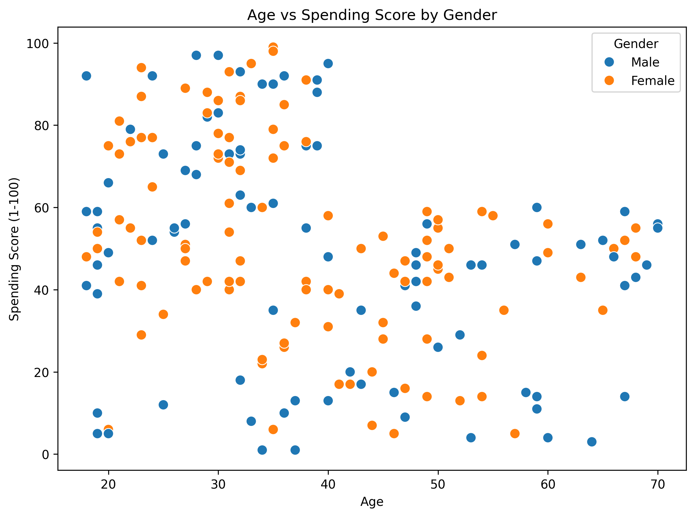
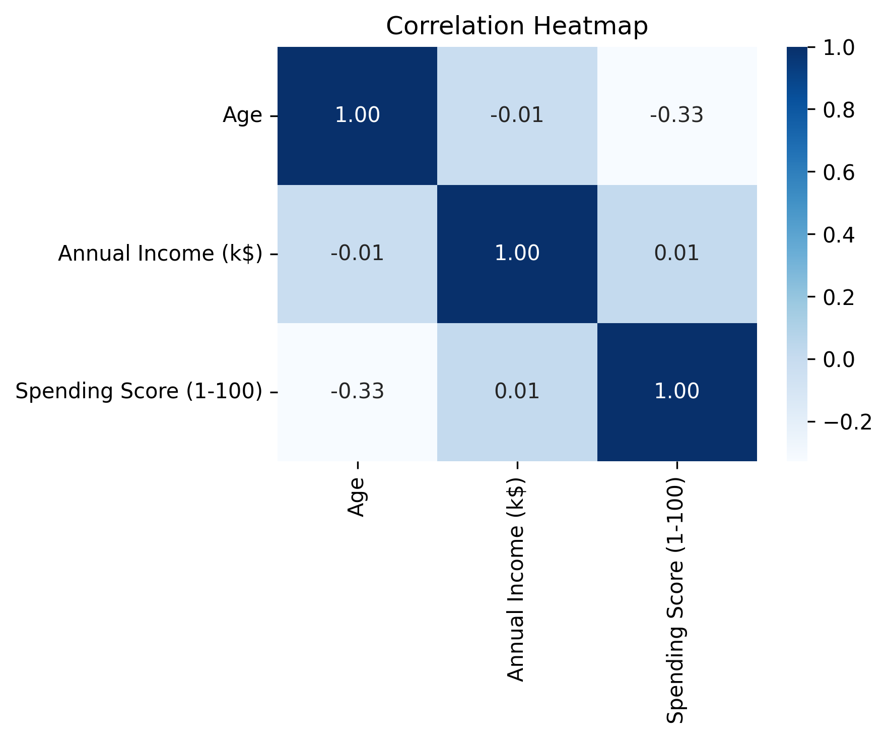
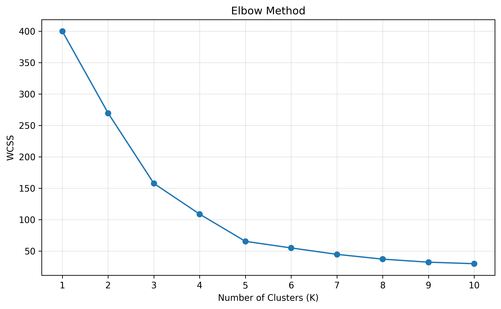
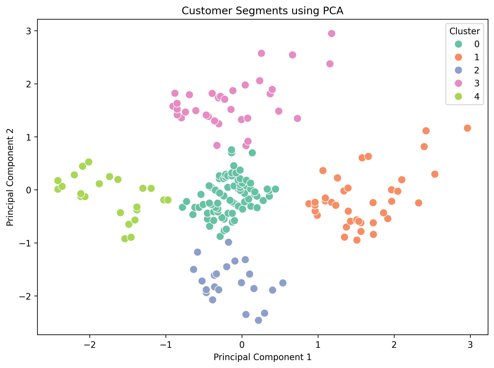

# Customer Segmentation Using Unsupervised Learning


---

# Table of Contents

- Project Results
- Project Overview
- Project Objectives
- Dataset Information
- Technologies Used
- Project Structure
- Data Quality Assessment
- Exploratory Data Analysis (EDA)
- Model Development
- Principal Component Analysis (PCA)
- Cluster Analysis
- Marketing Strategies
- Key Findings
- Conclusion
- Future Improvements
- How to Run the Project
- Repository Contents
- Skills Demonstrated
- Author
- Acknowledgements

---

# Project Results

| Metric | Value |
|---------|--------|
| Dataset Records | 200 |
| Dataset Features | 5 |
| Missing Values | None |
| Duplicate Records | None |
| Exploratory Data Analysis | Completed |
| Feature Scaling | Completed |
| K-Means Clustering | Completed |
| Optimal Number of Clusters | 5 |
| PCA Visualization | Completed |
| Customer Segments Identified | 5 |
| Marketing Strategies | Completed |

---

# Project Overview

This project applies **K-Means Clustering**, an unsupervised machine learning algorithm, to segment mall customers based on their **Annual Income** and **Spending Score**.

The project demonstrates a complete end-to-end customer segmentation workflow, including **Exploratory Data Analysis (EDA)**, **feature scaling**, **K-Means clustering**, **Principal Component Analysis (PCA)** for visualization, and **business-oriented marketing strategies** for each customer segment.

Customer segmentation enables businesses to better understand customer purchasing behavior, improve targeted marketing campaigns, increase customer satisfaction, and support data-driven business decisions.

This project was completed as part of the **DevelopersHub Corporation Data Science & Analytics Internship Program**.

---

# Project Objectives

The objectives of this project are:

- Understand the Mall Customers dataset.
- Perform Exploratory Data Analysis (EDA).
- Select appropriate features for customer segmentation.
- Standardize features using StandardScaler.
- Determine the optimal number of clusters using the Elbow Method.
- Apply the K-Means clustering algorithm.
- Visualize customer segments using Principal Component Analysis (PCA).
- Analyze the characteristics of each customer segment.
- Recommend business-oriented marketing strategies for every identified customer segment.

---

# Dataset Information

**Dataset:** Mall Customers Dataset

**Source:** Kaggle

https://www.kaggle.com/datasets/shwetabh123/mall-customers

**Problem Type:** Unsupervised Learning (Clustering)

**Algorithm:** K-Means Clustering

---

## Dataset Summary

| Attribute | Value |
|------------|-------|
| Dataset Name | Mall Customers Dataset |
| Source | Kaggle |
| Total Records | 200 |
| Total Features | 5 |
| Problem Type | Unsupervised Learning |
| Algorithm | K-Means Clustering |
| Domain | Retail and Marketing |

---

## Dataset Features

| Feature | Description |
|----------|-------------|
| CustomerID | Unique customer identifier |
| Genre | Customer gender |
| Age | Customer age (years) |
| Annual Income (k$) | Annual income in thousand dollars |
| Spending Score (1-100) | Spending score assigned by the shopping mall |

---

# Technologies Used

- Python
- Pandas
- NumPy
- Matplotlib
- Seaborn
- Scikit-learn
- Principal Component Analysis (PCA)
- Jupyter Notebook

---

# Project Structure

```text
Project-02-Customer-Segmentation/
│
├── dataset/
│   └── Mall_Customers.csv
│
├── outputs/
│   └── figures/
│
├── notebooks/
│   └── Customer_Segmentation.ipynb
│
├── requirements.txt
└── README.md
```

---

# Data Quality Assessment

Before performing customer segmentation, the dataset was examined to ensure its quality and suitability for clustering.

### Tasks Performed

- Dataset inspection
- Shape analysis
- Data type verification
- Missing values analysis
- Duplicate records verification
- Descriptive statistics
- Correlation analysis

---

# Exploratory Data Analysis (EDA)

Exploratory Data Analysis (EDA) was performed to understand customer demographics, income distribution, spending behavior, and relationships between key variables before applying the K-Means clustering algorithm.

The analysis focused on identifying customer patterns that could support meaningful customer segmentation and business decision-making.

---

## Visualizations Performed

The following visualizations were created during the exploratory data analysis phase:

- Gender Distribution
- Age Distribution
- Age Box Plot
- Annual Income Distribution
- Annual Income Box Plot
- Spending Score Distribution
- Spending Score Box Plot
- Annual Income vs Spending Score
- Age vs Spending Score
- Correlation Matrix
- Correlation Heatmap

---

# Sample Visualizations

## Gender Distribution

<p align="center">

</p>

This visualization shows the distribution of male and female customers. Female customers slightly outnumber male customers, although the dataset remains relatively balanced.

---

## Age Distribution

<p align="center">

</p>

The age distribution indicates that most customers belong to the young and middle-aged population, with the highest concentration between approximately **25 and 40 years**.

---

## Annual Income Distribution

<p align="center">

</p>

The annual income distribution shows that most customers earn between **40k and 80k dollars**, while relatively few customers fall into the highest income category.

---

## Spending Score Distribution

<p align="center">

</p>

Customer spending scores are distributed across the full range, indicating the presence of both low-spending and high-spending customers. This variation makes the dataset suitable for customer segmentation.

---

## Annual Income vs Spending Score

<p align="center">

</p>

This scatter plot highlights the relationship between annual income and spending score. Several natural customer groups are visible, suggesting that these features are well suited for K-Means clustering.

---

## Age vs Spending Score

<p align="center">

</p>

The relationship between age and spending score indicates that younger customers exhibit a wider range of spending behavior, whereas older customers generally demonstrate more moderate spending patterns.

---

## Correlation Heatmap

<p align="center">

</p>

The correlation heatmap shows that the numerical features have relatively weak correlations. This suggests that customer behavior depends on multiple characteristics rather than a single variable, supporting the use of clustering techniques.

---

# Exploratory Data Analysis Summary

The exploratory data analysis revealed several important insights regarding customer demographics and spending behavior.

Key observations include:

- Female customers slightly outnumber male customers.
- Most customers are between **25 and 40 years** of age.
- Annual income is concentrated around the middle-income range.
- Spending scores vary considerably across customers.
- Customers with similar incomes often exhibit different spending behaviors.
- The relationship between age and spending suggests that younger customers tend to have more diverse purchasing behavior.
- Correlation analysis indicates that no single feature fully explains customer behavior, reinforcing the need for customer segmentation using K-Means clustering.

---

# Model Development

After completing Exploratory Data Analysis (EDA), the dataset was prepared for customer segmentation using the **K-Means Clustering** algorithm.

The model development process included feature selection, feature scaling, determining the optimal number of clusters using the Elbow Method, training the K-Means model, and assigning cluster labels to each customer.

---

## Feature Selection

Two numerical features were selected for clustering:

- Annual Income (k$)
- Spending Score (1-100)

These features best represent customer purchasing behavior and are widely used for customer segmentation with the Mall Customers dataset.

---

## Feature Scaling

Before applying K-Means, the selected features were standardized using **StandardScaler**.

Feature scaling ensures that both variables contribute equally during distance calculations and prevents variables with larger numerical ranges from dominating the clustering process.

---

## Finding the Optimal Number of Clusters

The **Elbow Method** was used to determine the optimal value of **K**.

The Within-Cluster Sum of Squares (WCSS) was calculated for different values of **K**, and the elbow point indicated that **5 clusters** provide the best balance between cluster compactness and simplicity.

---

## Elbow Method

<p align="center">

</p>

The elbow point is observed at **K = 5**, indicating that five customer segments provide the optimal clustering solution.

---

## K-Means Clustering

Using the optimal value of **K = 5**, the K-Means algorithm was trained to segment customers based on their annual income and spending behavior.

Each customer was assigned to one of the five identified customer segments.

---

## Cluster Distribution

The trained model segmented the **200 customers** into five distinct clusters.

| Cluster | Number of Customers |
|----------|--------------------:|
| 0 | 81 |
| 1 | 39 |
| 2 | 22 |
| 3 | 35 |
| 4 | 23 |

The distribution indicates that customer groups vary in size, suggesting that certain purchasing behaviors are more common than others.

---

# Principal Component Analysis (PCA)

Principal Component Analysis (PCA) was applied to reduce the dimensionality of the standardized dataset while preserving most of the information contained in the original features.

The transformed data was then used to visualize the customer segments in a two-dimensional space.

---

## PCA Cluster Visualization

<p align="center">

</p>

The PCA visualization demonstrates that the K-Means algorithm successfully identified **five distinct customer segments**. Most clusters are well separated with minimal overlap, indicating effective customer segmentation.

---

# Cluster Analysis

The average annual income and spending score of each cluster were analyzed to understand the characteristics of different customer groups.

| Cluster | Average Annual Income (k$) | Average Spending Score |
|----------|---------------------------:|-----------------------:|
| 0 | 55.30 | 49.52 |
| 1 | 86.54 | 82.13 |
| 2 | 25.73 | 79.36 |
| 3 | 88.20 | 17.11 |
| 4 | 26.30 | 20.91 |

The analysis shows that each cluster represents a unique customer profile, ranging from high-income, high-spending customers to low-income, low-spending customers.

---

# Marketing Strategies

Based on the identified customer segments, the following business strategies are recommended.

| Cluster | Customer Profile | Recommended Marketing Strategy |
|---------|------------------|--------------------------------|
| Cluster 0 | Moderate Income – Moderate Spending | Offer loyalty programs, seasonal discounts, and personalized recommendations to improve customer engagement. |
| Cluster 1 | High Income – High Spending | Provide VIP memberships, exclusive offers, premium products, and early access to new collections. |
| Cluster 2 | Low Income – High Spending | Encourage repeat purchases through reward points, cashback offers, and affordable product bundles. |
| Cluster 3 | High Income – Low Spending | Increase engagement with personalized promotions, premium product recommendations, and limited-time discounts. |
| Cluster 4 | Low Income – Low Spending | Attract customers using budget-friendly products, promotional campaigns, and special discount offers. |

---

# Key Findings

The customer segmentation analysis provided several valuable business insights regarding customer purchasing behavior and spending patterns.

The major findings from this project are summarized below:

- Customer spending behavior varies significantly across different income groups.
- Customers with similar annual incomes can exhibit very different spending patterns.
- The Elbow Method identified **5** as the optimal number of customer segments.
- K-Means Clustering successfully grouped customers into five meaningful segments.
- PCA visualization confirmed that the identified clusters are well separated with minimal overlap.
- Customer segmentation enables businesses to design targeted marketing campaigns for different customer groups.
- Personalized marketing strategies can improve customer engagement, loyalty, and overall business performance.

---

# Conclusion

The primary objective of this project was to segment mall customers based on their purchasing behavior using **K-Means Clustering**.

A complete unsupervised machine learning workflow was implemented, including data quality assessment, exploratory data analysis, feature selection, feature scaling, customer segmentation, and dimensionality reduction using **Principal Component Analysis (PCA)**.

The Elbow Method identified **five** as the optimal number of customer segments. The K-Means algorithm successfully grouped customers into meaningful clusters based on **Annual Income** and **Spending Score**, while PCA provided a clear visualization of these customer segments.

Finally, business-oriented marketing strategies were proposed for each customer segment, demonstrating how customer segmentation can support targeted marketing and data-driven business decisions.

---

# Future Improvements

Possible improvements for future versions of this project include:

- Experimenting with additional clustering algorithms such as DBSCAN or Agglomerative Clustering.
- Comparing K-Means performance with Gaussian Mixture Models (GMM).
- Including additional customer features to improve segmentation.
- Developing an interactive dashboard using Streamlit or Power BI.
- Deploying the clustering model as a web application.

---

# How to Run the Project

## 1. Clone the Repository

```bash
git clone https://github.com/huzaifawaheed2/DevelopersHub-Corporation-Advanced-Internship.git
```

---

## 2. Navigate to the Project Folder

```bash
cd DevelopersHub-Corporation-Advanced-Internship/Project-02-Customer-Segmentation
```

---

## 3. Install Required Libraries

```bash
pip install -r requirements.txt
```

---

## 4. Open Jupyter Notebook

```bash
jupyter notebook
```

---

## 5. Run the Notebook

```text
notebooks/term_deposit_prediction.ipynb
```

---

# Repository Contents

```text
Project-02-Customer-Segmentation/
│
├── dataset/
│   └── Mall_Customers.csv
│
├── outputs/
│   └── figures/
│
├── notebooks/
│   └── Customer_Segmentation.ipynb
│
├── requirements.txt
└── README.md
```

---

# Skills Demonstrated

- Data Quality Assessment
- Exploratory Data Analysis (EDA)
- Data Visualization
- Feature Selection
- Feature Scaling
- Unsupervised Machine Learning
- K-Means Clustering
- Elbow Method
- Principal Component Analysis (PCA)
- Customer Segmentation
- Business Insight Generation
- Marketing Strategy Development

---

# Author

## Muhammad Huzaifa Waheed

Data Analyst | Power BI Developer | QA Engineer

### Connect With Me

- GitHub: [huzaifawaheed2](https://github.com/huzaifawaheed2)
- LinkedIn: [Muhammad Huzaifa Waheed](https://www.linkedin.com/in/muhammad-huzaifa-waheed-70043338b)

---

# Acknowledgements

This project was completed as part of the **DevelopersHub Corporation Data Science & Analytics Internship Program**.

The **Mall Customers Dataset** used in this project was obtained from **Kaggle** and is intended for educational and research purposes.

---

⭐ **If you found this project helpful, consider giving this repository a star!**