# Global Superstore Business Intelligence Dashboard
[](https://global-superstore-bi-dashboard.streamlit.app/)


---

# Table of Contents

- Project Results
- Live Dashboard
- Dashboard Preview
- Project Overview
- Project Objectives
- Dataset Information
- Data Preprocessing
- Exploratory Data Analysis (EDA)
- EDA Visualizations
- Dashboard Features
- Technologies Used
- Project Structure
- Business Insights
- Key Findings
- Conclusion
- Future Improvements
- How to Run the Project
- Repository Contents
- Skills Demonstrated
- Author
- Acknowledgements

---

# Project Results

| Metric | Value |
|---------|--------|
| Original Dataset Records | 51,290 |
| Original Dataset Features | 24 |
| Engineered Features | 7 |
| Final Dataset Features | 31 |
| Missing Values | None |
| Duplicate Records | None |
| Data Cleaning | Completed |
| Feature Engineering | Completed |
| Exploratory Data Analysis (EDA) | Completed |
| Interactive Streamlit Dashboard | Completed |
| KPI Cards | 8 |
| Interactive Filters | 7 |
| Interactive Business Charts | 12 |
| Global Sales Map | Completed |
| Downloadable Filtered Dataset | Available |
| Live Dashboard | Deployed on Streamlit Community Cloud |

---

# Live Dashboard

🚀 **Live Demo**

**Streamlit Community Cloud**

https://global-superstore-bi-dashboard.streamlit.app/

Explore the fully interactive Business Intelligence dashboard directly in your browser without installing any software.

---

# Dashboard Preview

The following screenshots showcase the major components of the **Global Superstore Business Intelligence Dashboard** developed using **Streamlit**.

The dashboard enables users to monitor business performance through interactive KPI cards, dynamic filters, business charts, and geographical visualizations, allowing users to explore the dataset from multiple business perspectives.

---

## Dashboard Overview

<p align="center">
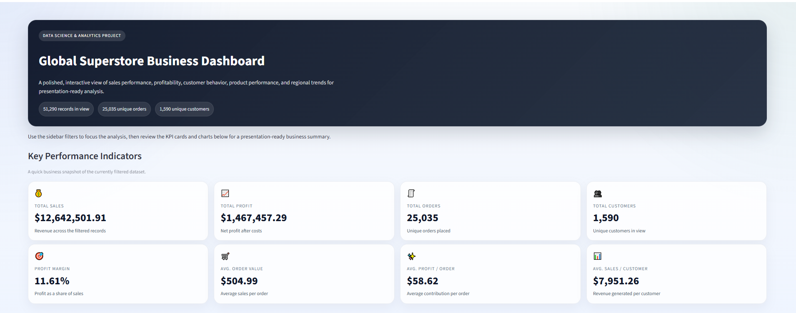
</p>

The dashboard home page provides a complete overview of business performance through executive KPI cards, interactive charts, and sidebar filters. Users can instantly monitor sales, profit, orders, customers, and overall business performance.
The dashboard has also been deployed on **Streamlit Community Cloud**, allowing users to explore the interactive Business Intelligence application directly from their web browser.

---

## Category & Market Performance

<p align="center">
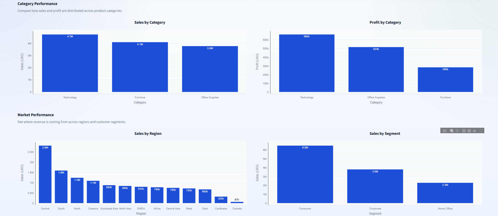
</p>

This section compares sales and profit across product categories while also analyzing regional and customer segment performance. These visualizations help identify the most profitable categories and strongest business markets.

---

## Sales Trend, Products & Customers

<p align="center">
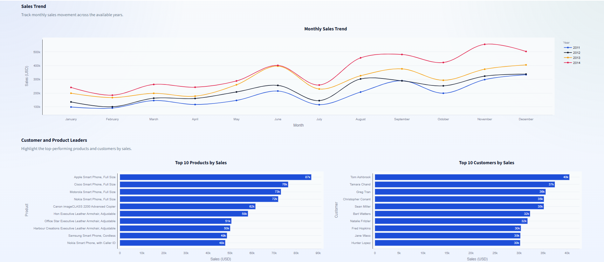
</p>

Monthly sales trends, top-performing products, and top customers are presented together to help users identify sales patterns, customer value, and product performance over time.

---

## Profitability & Market Analysis

<p align="center">
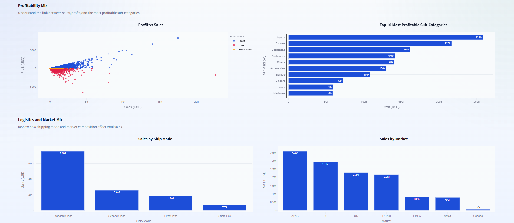
</p>

The dashboard analyzes the relationship between sales and profit while comparing shipping modes, market performance, and top-performing product sub-categories to support profitability analysis.

---

## Global Sales Analysis

<p align="center">
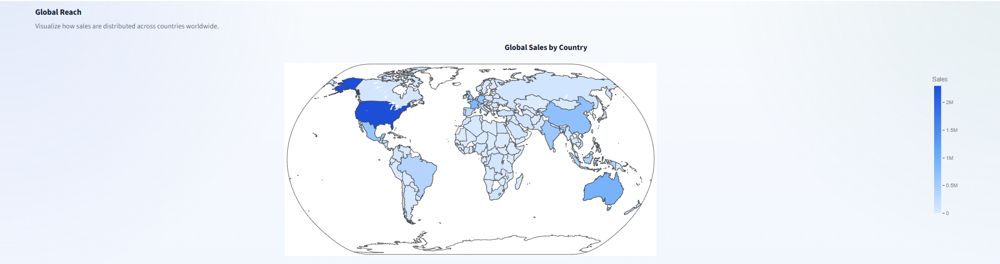
</p>

The interactive world map visualizes sales across different countries, making it easy to identify global sales distribution and high-performing markets.

---

## Product Performance

<p align="center">
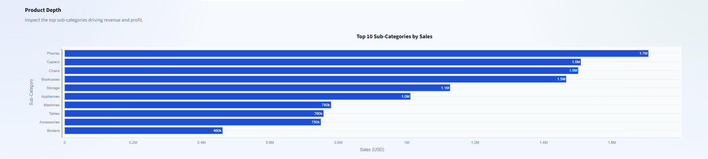
</p>

This section highlights the best-performing product sub-categories, enabling businesses to understand which products contribute the most to total sales.

---

## Filtered Dataset

<p align="center">
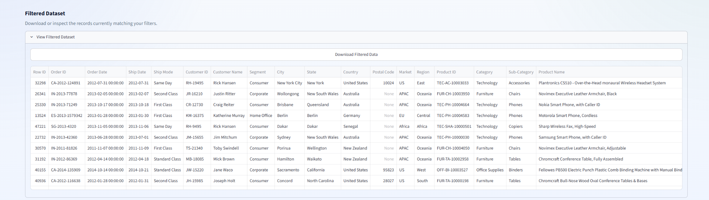
</p>

Users can inspect the filtered dataset directly within the dashboard and download the selected records as a CSV file for additional reporting or analysis.

---

## About Dashboard

<p align="center">
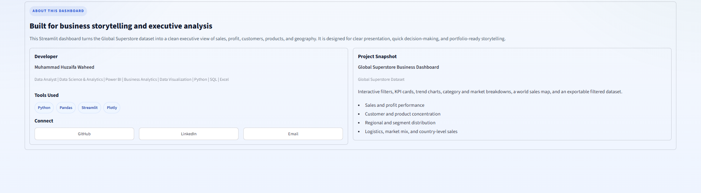
</p>

The About section provides project information, development tools, technologies used, and developer contact information for easy reference.

---

## Dashboard Filters

<p align="center">
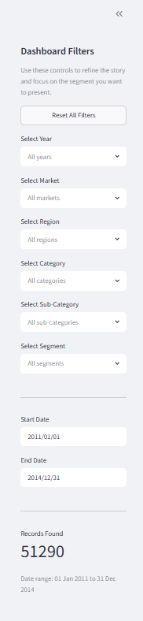
</p>

Interactive sidebar filters allow users to analyze the dataset by **Year**, **Market**, **Region**, **Category**, **Sub-Category**, **Segment**, and **Date Range**. A **Reset All Filters** option enables users to restore the default dashboard view with a single click.

---

# Project Overview

This project presents a complete **Business Intelligence Dashboard** developed using **Streamlit** to analyze the **Global Superstore Dataset**.

The project follows a complete data analytics workflow beginning with **data cleaning**, **feature engineering**, and **exploratory data analysis (EDA)** in Jupyter Notebook before building an interactive dashboard for business reporting.

A total of **seven additional analytical features** were engineered from the original dataset to improve reporting capabilities and support time-based business analysis.

The dashboard enables users to analyze sales performance, profitability, customer behavior, product performance, regional performance, and global market trends through interactive KPI cards, dynamic filters, and business visualizations.

This project demonstrates practical knowledge of data preprocessing, exploratory data analysis, business intelligence, dashboard development, and data visualization.

The project was completed as part of the **DevelopersHub Corporation Data Science & Analytics Internship Program**.

---

# Project Objectives

The objectives of this project are:

- Clean and preprocess the Global Superstore dataset.
- Perform feature engineering for business reporting.
- Conduct Exploratory Data Analysis (EDA).
- Build an interactive Business Intelligence dashboard using Streamlit.
- Design executive-style KPI cards.
- Develop interactive business visualizations using Plotly.
- Implement dynamic sidebar filters.
- Analyze sales, profit, customers, products, markets, and regions.
- Visualize worldwide sales using an interactive choropleth map.
- Enable downloading of filtered datasets.
- Generate meaningful business insights to support data-driven decision-making.

---

# Dataset Information

**Dataset:** Global Superstore Dataset

**Source:** Kaggle

https://www.kaggle.com/datasets/apoorvaappz/global-super-store-dataset

**Project Type:** Business Intelligence Dashboard

**Domain:** Retail & E-Commerce

---

## Dataset Summary

| Attribute | Value |
|------------|-------|
| Dataset Name | Global Superstore Dataset |
| Source | Kaggle |
| Original Records | 51,290 |
| Original Features | 24 |
| Engineered Features | 7 |
| Final Features | 31 |
| Domain | Retail & E-Commerce |
| Project Type | Business Intelligence Dashboard |

---

## Original Dataset Features

The original Global Superstore dataset contains **24 business-related features** describing customer information, product details, order information, geographical locations, and sales transactions.

| Feature | Description |
|----------|-------------|
| Row ID | Unique row identifier |
| Order ID | Unique order identifier |
| Order Date | Date when the order was placed |
| Ship Date | Date when the order was shipped |
| Ship Mode | Shipping method |
| Customer ID | Unique customer identifier |
| Customer Name | Customer name |
| Segment | Customer segment |
| City | Customer city |
| State | Customer state |
| Country | Customer country |
| Postal Code | Postal code |
| Market | Business market |
| Region | Business region |
| Product ID | Unique product identifier |
| Category | Product category |
| Sub-Category | Product sub-category |
| Product Name | Product name |
| Sales | Sales amount |
| Quantity | Number of items sold |
| Discount | Discount applied |
| Profit | Profit earned |
| Shipping Cost | Shipping cost |
| Order Priority | Order priority |

---

## Engineered Features

To improve reporting capabilities and support dashboard development, additional analytical features were created from the **Order Date** and **Profit** columns during data preprocessing.

| Feature | Description |
|----------|-------------|
| Order Year | Extracted year from Order Date |
| Order Quarter | Quarter of the year |
| Order Month | Month number for chronological sorting |
| Order Month Name | Month name for dashboard visualizations |
| Order Day | Day of the month |
| Order Day Name | Weekday name (Monday–Sunday) |
| Profit Status | Classifies each transaction as Profit, Loss, or Break-even |

---

# Data Preprocessing

Before building the interactive dashboard, the dataset was prepared using a dedicated **Jupyter Notebook**.

The preprocessing workflow focused on improving data quality, engineering additional analytical features, and preparing the dataset for business reporting and visualization.

---

## Data Cleaning Tasks

The following preprocessing tasks were completed:

- Dataset inspection
- Shape analysis
- Data type verification
- Missing values analysis
- Duplicate records verification
- Order Date conversion to datetime format
- Feature engineering
- Profit Status classification
- Final dataset export for dashboard development

---

## Feature Engineering

Feature engineering was performed to improve analytical capabilities and support dynamic dashboard reporting.

The following features were generated:

- Order Year
- Order Quarter
- Order Month
- Order Month Name
- Order Day
- Order Day Name
- Profit Status

These engineered features enabled time-based analysis, chronological sorting, profitability classification, and dynamic filtering within the Streamlit dashboard.

---

# Exploratory Data Analysis (EDA)

Exploratory Data Analysis (EDA) was performed before developing the Streamlit dashboard to better understand the Global Superstore dataset and identify important business patterns.

The analysis focused on evaluating sales performance, profitability, customer behavior, product performance, and regional trends. These insights were later used to design KPI cards, interactive filters, and business visualizations for the dashboard.

---

## Visualizations Performed

The following visualizations were created during the Exploratory Data Analysis phase:

- Sales by Category
- Profit by Category
- Sales by Region
- Sales by Segment
- Monthly Sales Trend
- Top 10 Customers by Sales
- Top 10 Products by Sales
- Profit vs Sales Analysis
- Profit and Loss Summary
- Correlation Heatmap

---

# EDA Visualizations

## Sales by Category

<p align="center">
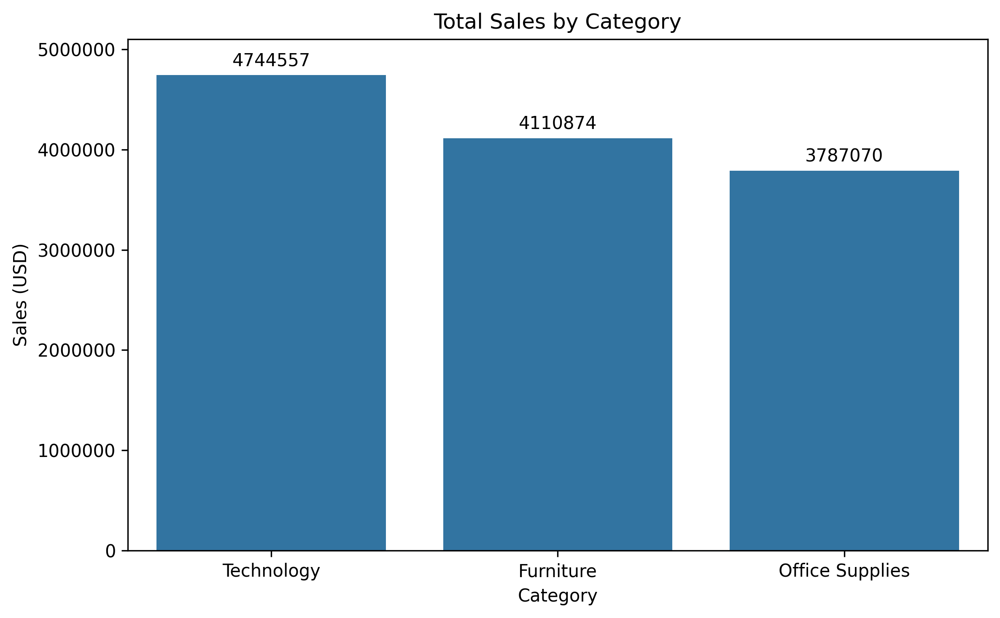
</p>

This visualization compares total sales across different product categories. It helps identify which categories contribute the highest revenue and provides valuable insights into product performance.

---

## Profit by Category

<p align="center">
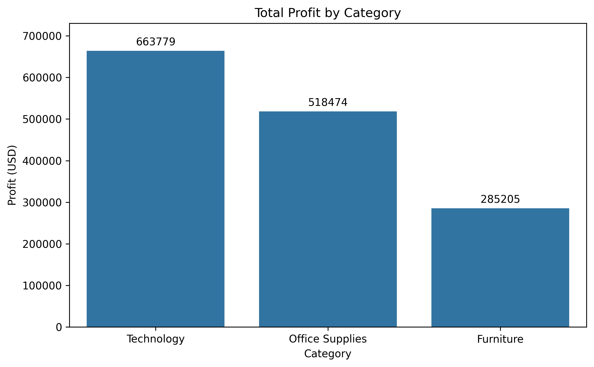
</p>

The chart compares total profit generated by each product category, allowing businesses to evaluate category profitability alongside overall sales performance.

---

## Sales by Region

<p align="center">
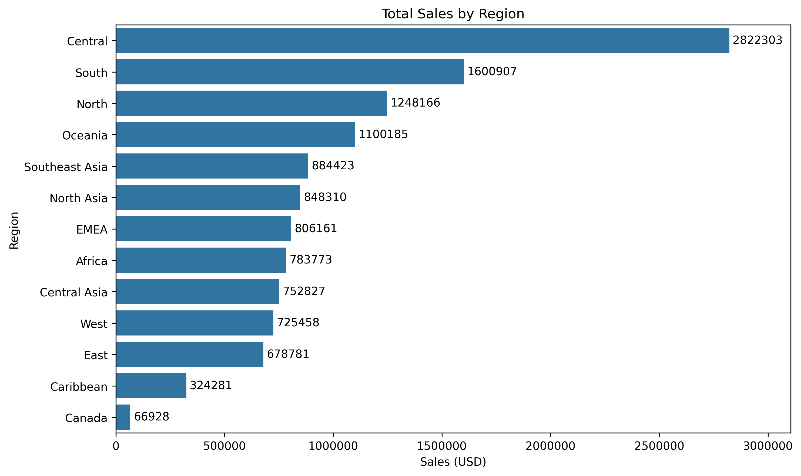
</p>

Regional sales analysis highlights the contribution of different business regions and helps identify high-performing geographical markets.

---

## Sales by Segment

<p align="center">
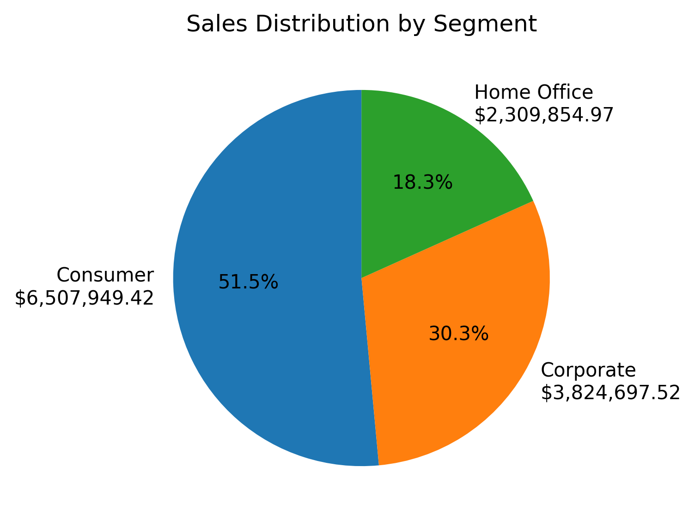
</p>

This visualization compares sales across customer segments, providing insights into which customer groups generate the highest business revenue.

---

## Monthly Sales Trend

<p align="center">
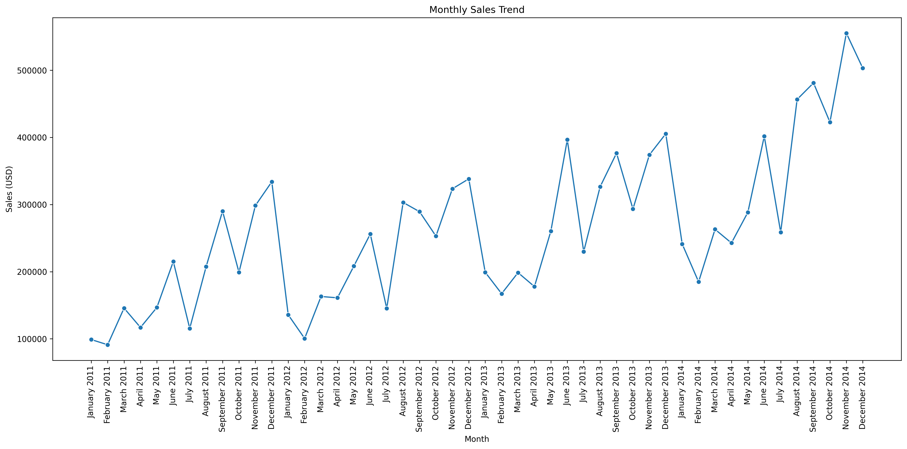
</p>

The monthly sales trend illustrates business performance over time and helps identify seasonal sales patterns and long-term growth trends.

---

## Top 10 Customers by Sales

<p align="center">
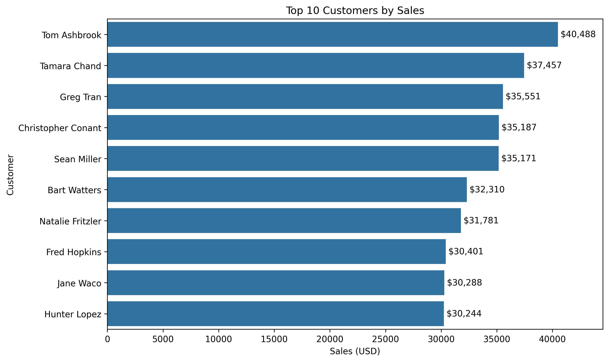
</p>

This chart identifies the top-performing customers based on total sales, supporting customer relationship management and targeted business strategies.

---

## Top 10 Products by Sales

<p align="center">
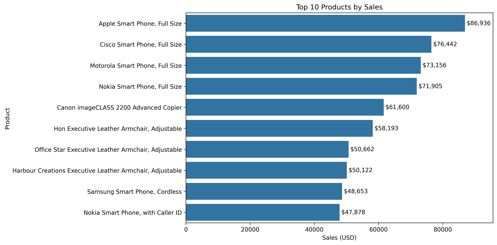
</p>

The visualization highlights the highest-selling products, enabling businesses to identify their strongest revenue-generating products.

---

## Profit vs Sales Analysis

<p align="center">
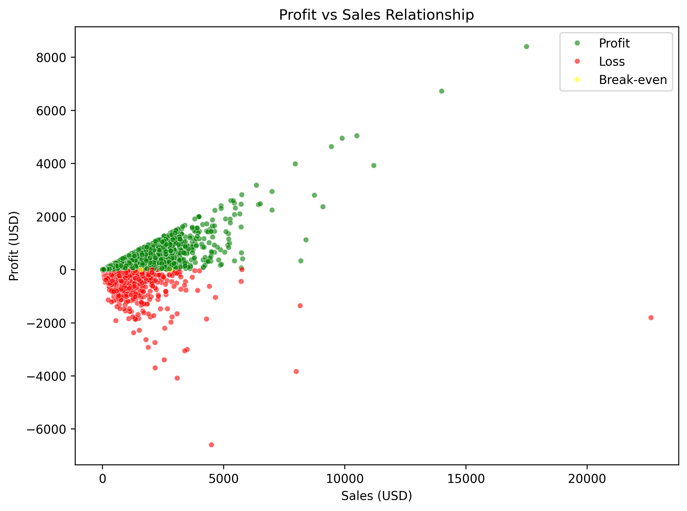
</p>

This scatter plot illustrates the relationship between sales and profit while distinguishing profitable, loss-making, and break-even transactions.

---

## Profit and Loss Summary

<p align="center">
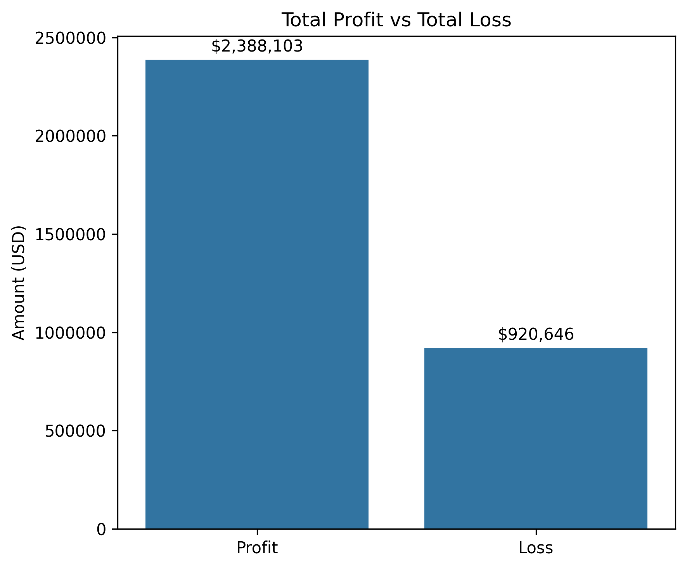
</p>

This visualization provides a quick comparison between total profit and total loss, helping evaluate the organization's overall financial performance.

---

## Correlation Heatmap

<p align="center">
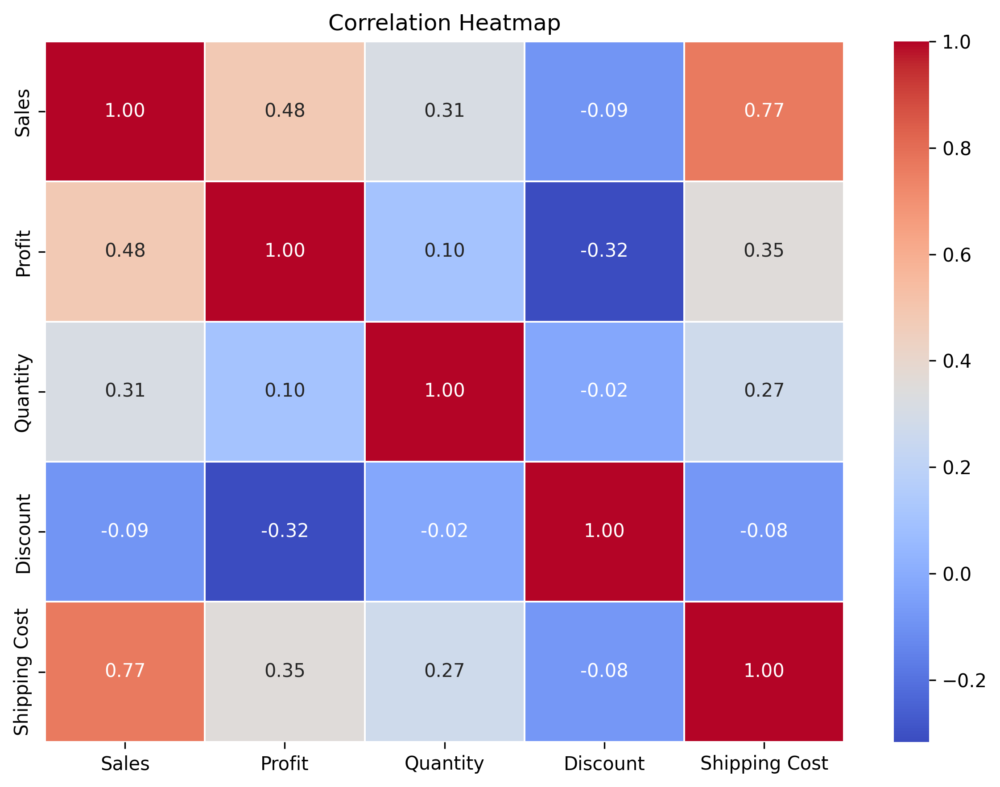
</p>

The correlation heatmap illustrates relationships between numerical variables, helping identify positive and negative correlations that support deeper business analysis.

---

# Exploratory Data Analysis Summary

The exploratory data analysis revealed several important business insights before developing the interactive dashboard.

Key observations include:

- Technology generated the highest sales among all product categories.
- Profitability varied significantly across product categories.
- Sales performance differed across business regions and markets.
- Consumer customers contributed a substantial portion of total sales.
- Monthly sales exhibited seasonal fluctuations.
- A small number of customers generated a large share of total revenue.
- Product performance was concentrated among a limited number of high-selling products.
- Sales and profit showed a generally positive relationship, although some high-sales transactions resulted in losses due to discounts and shipping costs.
- Correlation analysis highlighted the relationships between key numerical variables used in the dashboard.

---

# Dashboard Features

The Streamlit dashboard transforms the cleaned Global Superstore dataset into an interactive Business Intelligence solution.

It allows users to explore sales performance, profitability, customer behavior, product trends, and regional performance through interactive KPI cards, business charts, and dynamic sidebar filters.

The dashboard is designed to support business reporting, data exploration, and decision-making without requiring any programming knowledge.

---

## Key Features

The dashboard includes the following features:

- Interactive Business Dashboard
- Executive KPI Cards
- Dynamic Sidebar Filters
- Sales Performance Analysis
- Profitability Analysis
- Product Performance Analysis
- Customer Performance Analysis
- Regional Performance Analysis
- Market Performance Analysis
- Global Sales Map
- Downloadable Filtered Dataset
- Responsive Dashboard Layout

---

# Dashboard KPI Cards

The dashboard displays eight Key Performance Indicators (KPIs) that provide an instant overview of overall business performance.

| KPI | Description |
|-----|-------------|
| Total Sales | Total sales generated after applying filters |
| Total Profit | Overall business profit |
| Total Orders | Number of unique customer orders |
| Total Customers | Number of unique customers |
| Profit Margin | Profit percentage based on total sales |
| Average Order Value | Average revenue generated per order |
| Average Profit per Order | Average profit earned per order |
| Average Sales per Customer | Average sales generated per customer |

These KPI cards update automatically whenever dashboard filters are changed, allowing users to perform real-time business analysis.

---

# Dashboard Filters

The dashboard provides interactive sidebar filters that enable users to explore the dataset from multiple business perspectives.

### Available Filters

- Order Year
- Market
- Region
- Category
- Sub-Category
- Segment
- Date Range

A **Reset All Filters** button is also included to restore the dashboard to its default state with a single click.

---

# Business Insights

The dashboard enables users to answer important business questions such as:

- Which product categories generate the highest sales?
- Which categories are the most profitable?
- Which customers contribute the most revenue?
- Which products perform best?
- Which regions and markets generate the highest sales?
- How do monthly sales change over time?
- Which shipping modes are used most frequently?
- Which countries contribute the highest sales?
- Which transactions generate profit or loss?
- How do business metrics change after applying filters?

The interactive nature of the dashboard allows users to quickly explore these insights without writing any code.

---

# Key Findings

The dashboard provides several valuable business insights.

Major findings include:

- Sales are concentrated within a few high-performing product categories.
- Profitability varies across categories despite similar sales volumes.
- Customer purchasing behavior differs significantly across market segments.
- A relatively small number of customers contribute a large portion of total sales.
- Product performance varies considerably across different markets.
- Monthly sales trends reveal seasonal business patterns.
- Global sales distribution highlights the organization's strongest international markets.
- Dynamic filtering enables deeper exploration of business performance across multiple dimensions.

---

# Conclusion

This project demonstrates a complete Business Intelligence workflow, beginning with data preprocessing and exploratory data analysis in Jupyter Notebook and ending with the development of an interactive Streamlit dashboard.

The dashboard transforms raw transactional data into meaningful business insights through KPI cards, interactive charts, geographical visualizations, and dynamic filters.

Overall, the project showcases practical skills in data cleaning, feature engineering, exploratory data analysis, dashboard development, and business intelligence while supporting data-driven decision-making.

---

# Future Improvements

Possible enhancements for future versions of this project include:

- Add advanced business KPI visualizations.
- Integrate predictive analytics for sales forecasting.
- Develop customer segmentation using machine learning.
- Add inventory and supply chain analysis.
- Connect the dashboard to a live SQL database.
- Deploy the dashboard on Streamlit Community Cloud.
- Implement user authentication and role-based access.
- Add export functionality for charts and business reports.
- Support multiple dashboard themes (Light/Dark Mode).
- Develop a Power BI version of the dashboard for enterprise reporting.

---

# How to Run the Project

## 1. Clone the Repository

```bash
git clone https://github.com/huzaifawaheed2/DevelopersHub-Corporation-Advanced-Internship.git
```

---

## 2. Navigate to the Project Folder

```bash
cd DevelopersHub-Corporation-Advanced-Internship/Project-03-Interactive-Business-Dashboard
```

---

## 3. Install Required Libraries

```bash
pip install -r requirements.txt
```

---

## 4. Launch the Streamlit Application

```bash
streamlit run app/app.py
```

---

## 5. Open the Dashboard

After running the above command, Streamlit will automatically open the dashboard in your default web browser.

---

## Live Demo

If you only want to explore the dashboard, simply open the deployed application in your web browser.

https://global-superstore-bi-dashboard.streamlit.app/

---

# Repository Contents

```text
Project-03-Interactive-Business-Dashboard/
│
├── app/
│   ├── assets/
│   │   └── style.css
│   ├── app.py
│   ├── charts.py
│   ├── config.py
│   ├── data_loader.py
│   ├── filters.py
│   ├── metrics.py
│   └── utils.py
│
├── dataset/
│   ├── Global_Superstore.csv
│   └── Global_Superstore_Cleaned.csv
│
├── notebooks/
│   └── Business_Dashboard_Preprocessing.ipynb
│
├── outputs/
│   ├── figures/
│   └── screenshots/
│
├── README.md
└── requirements.txt
```

---

# Skills Demonstrated

This project demonstrates practical skills in:

- Data Cleaning
- Data Preprocessing
- Feature Engineering
- Exploratory Data Analysis (EDA)
- Business Intelligence
- Dashboard Development
- Interactive Data Visualization
- KPI Design
- Business Analytics
- Retail Sales Analysis
- Customer Analysis
- Product Performance Analysis
- Regional Performance Analysis
- Geographical Data Visualization
- Streamlit Application Development
- Plotly Visualization
- Data Storytelling

---

# Author

## Muhammad Huzaifa Waheed

Data Analyst | Power BI Developer | QA Engineer

### Connect With Me

- GitHub: [huzaifawaheed2](https://github.com/huzaifawaheed2)
- LinkedIn: [Muhammad Huzaifa Waheed](https://www.linkedin.com/in/muhammad-huzaifa-waheed-70043338b)

---

# Acknowledgements

This project was completed as part of the **DevelopersHub Corporation Data Science & Analytics Internship Program**.

The project uses the **Global Superstore Dataset** obtained from **Kaggle** for educational and portfolio development purposes.

Special thanks to the open-source Python community for providing powerful libraries such as **Pandas**, **Matplotlib**, **Seaborn**, **Streamlit**, and **Plotly**, which made this project possible.

---

⭐ **If you found this project useful, consider giving this repository a star!**